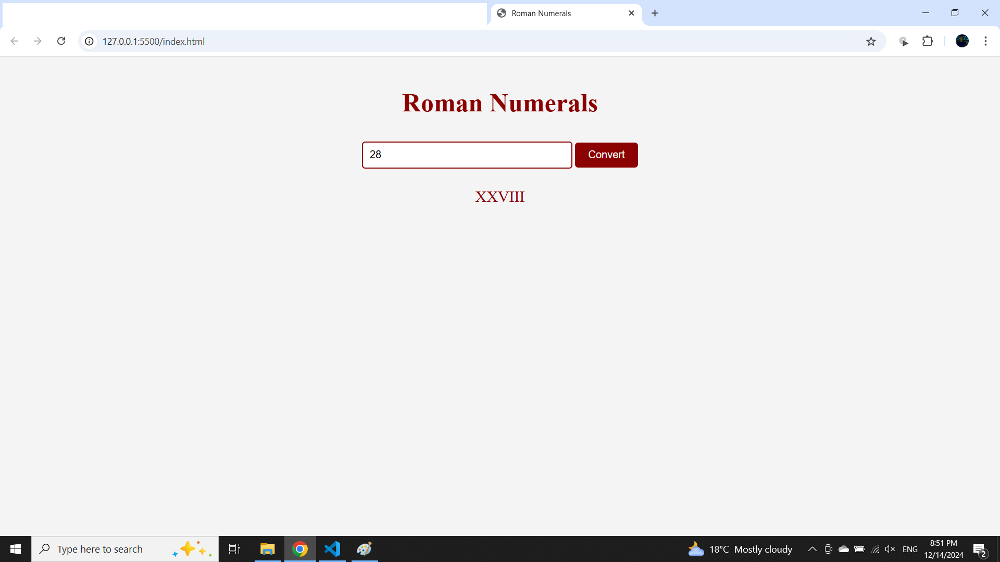

# Roman Numerals Project

## Overview
This project is a web application that converts decimal numbers into Roman numerals. It features a simple user interface where users can input a number, click a button to convert it, and see the result displayed on the page.

## Files Description
- **index.html**: Contains the HTML structure, including an input field for the number, a button to trigger the conversion, and an output element to display the result.
- **styles.css**: Provides styling to give the web page a Roman theme, enhancing its visual appeal.
- **script.js**: Implements the logic for converting decimal numbers to Roman numerals.

## Screenshot

## Usage
1. Open `index.html` in a web browser.
2. Enter a number between 1 and 3999 in the input field.
3. Click the "Convert" button to see the Roman numeral equivalent displayed.

## License
This project is licensed under the MIT License.